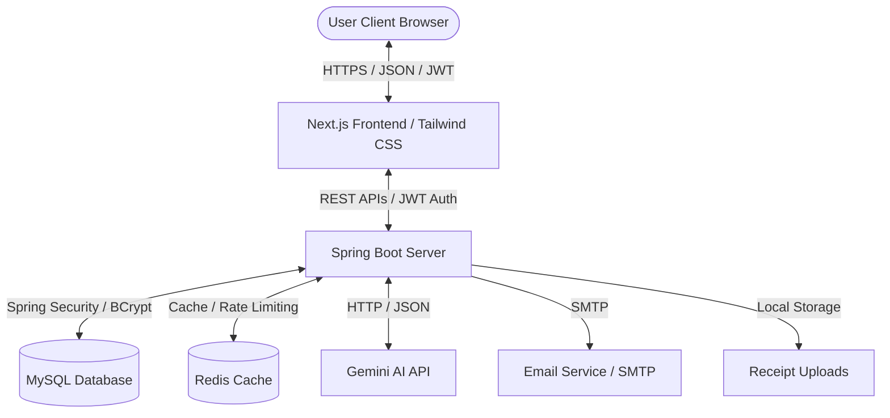
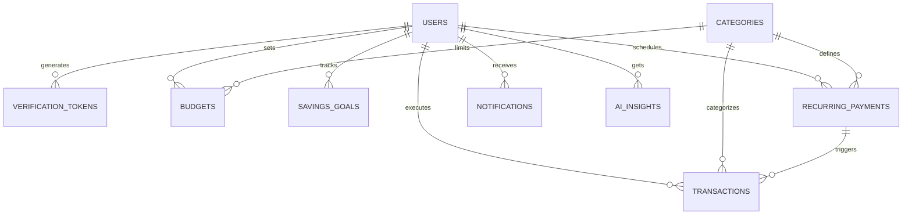

# FinSight – AI-Powered Smart Expense Tracker

**FinSight** is a production-grade, personal finance management platform engineered to help users track transactions, manage budgets, schedule automated recurring bills, monitor savings goals, and receive AI-driven financial counseling. 

Designed with a modern, micro-cache architecture and integrated with the **Gemini AI API**, the platform generates automated spending insights, budget optimization plans, and computes an algorithmic/AI-based Financial Health Score.

---

## 👨‍💻 Developer Information
*   **Developer Name:** PODUGU MUKESH
*   **Email:** [mukeshpodugu123@gmail.com](mailto:mukeshpodugu123@gmail.com)
*   **Phone:** +91 8143999463
*   **Location:** Srikakulam, Andhra Pradesh, India
*   **GitHub/Portfolio:** [github.com/mukeshpodugu](https://github.com/mukeshpodugu) (Representation)

---

## 🚀 Resume-Ready Project Description
**FinSight — AI-Powered Smart Personal Finance Tracker (Full-Stack Platform)**
*   **System Architecture:** Developed a personal finance tracker using a secure, stateless backend (**Java 21, Spring Boot, Spring Security, JWT**) and a dynamic frontend (**React/Next.js 14, Tailwind CSS, Recharts**).
*   **Database & Cache:** Designed a normalized MySQL relational schema (3NF) containing indexes for queries acceleration. Configured **Redis** to cache user metadata and AI insights, minimizing external API costs.
*   **AI Integration:** Integrated **Gemini AI API (gemini-1.5-flash)** using custom REST connectors to parse user transactions and output spending counseling, budget allocations (50/30/20 rule), and calculate a Financial Health Score.
*   **Reporting & Automation:** Programmed a scheduled cron runner in Spring Boot to automatically trigger recurring transactions (subscriptions/rent). Implemented exporters utilizing **OpenPDF** (Monthly PDF) and **Apache POI** (Excel ledger).
*   **DevOps & Packaging:** Containerized the full-stack system using **Docker** and **Docker Compose**, establishing multi-container networks for local deployment.

---

## 🛠 Tech Stack
*   **Backend:** Java 21, Spring Boot 3.3.x, Spring Security (Stateless JWT, BCrypt), Spring Data JPA, Hibernate
*   **Frontend:** React / Next.js 14 (App Router, TypeScript), Tailwind CSS, Recharts
*   **Database:** MySQL 8.0 (Relational schema)
*   **Caching:** Redis 7.2 (Insights cache & rate limiting)
*   **AI Engine:** Gemini AI API (`gemini-1.5-flash` model)
*   **Libraries:** OpenPDF (PDF Exporter), Apache POI (Excel Ledger), Springdoc OpenAPI/Swagger (API Docs)
*   **DevOps:** Docker, Docker Compose, Multi-stage builds

---

## 📐 System Architecture Diagram


---

## 🗄 Entity-Relationship (ER) Diagram


---

## 📂 Project Directory Structure

### Backend Layout (`/backend`)
*   `pom.xml` - Build configurations containing JWT, OpenPDF, POI, and JPA plugins.
*   `src/main/java/com/finsight/`
    *   `FinSightApplication.java` - Boot class with caching and scheduler flags enabled.
    *   `config/` - Security policies, CORS controls, database seeding initializers.
    *   `controller/` - REST Endpoints for Auth, Ledger, budgets, AI insights, and reports.
    *   `dto/` - Validation payload structures.
    *   `entity/` - Database tables models maps (JPA Entities).
    *   `exception/` - Unified error handler class (`GlobalExceptionHandler`).
    *   `repository/` - Spring Data JPA query mappings.
    *   `scheduler/` - Automated billing background runner.
    *   `security/` - JWT parser class, interceptor filters.
    *   `service/` - Primary business calculations, REST integrations (Gemini, Report builders).

### Frontend Layout (`/frontend`)
*   `package.json` - Node dependencies.
*   `tailwind.config.js` / `postcss.config.js` - Styling engine configurations.
*   `tsconfig.json` - Path mapping setups (`@/*`).
*   `src/app/`
    *   `layout.tsx` - Layout file with Google Fonts link.
    *   `globals.css` - Custom styling tokens, light/dark variables, glassmorphic layout utilities.
    *   `page.tsx` - Interactive client portal utilizing Recharts dashboard views.

---

## 🔌 API Documentation (REST endpoints)

All endpoints (except `/api/v1/auth/**`) require the HTTP header: `Authorization: Bearer <JWT_TOKEN>`.

| Method | Endpoint | Request Parameter / Body | Description |
| :--- | :--- | :--- | :--- |
| **POST** | `/api/v1/auth/register` | `RegisterRequest` (JSON) | Creates unverified user, seeds verification link |
| **POST** | `/api/v1/auth/login` | `LoginRequest` (JSON) | Validates credentials, returns JWT token |
| **POST** | `/api/v1/auth/verify-email` | `token` (Query) | Activates user account |
| **POST** | `/api/v1/auth/forgot-password`| `email` (Query) | Generates password reset link |
| **GET** | `/api/v1/transactions` | `type`, `categoryId`, `startDate`, `endDate`, `search`, `page`, `size` | Lists ledger entries with pagination |
| **POST** | `/api/v1/transactions` | Multipart: `transaction` (JSON) + `receipt` (File) | Logs transaction & checks budget utilization |
| **DELETE**| `/api/v1/transactions/{id}`| `id` (Path) | Removes transaction log |
| **POST** | `/api/v1/budgets` | `BudgetRequest` (JSON) | Configures spending limit on expense category |
| **GET** | `/api/v1/budgets/utilization`| `month`, `year` (Query) | Compares budgets against category spent amounts |
| **PUT** | `/api/v1/savings-goals/{id}/contribute`| `id` (Path), `amount` (Query) | Registers goal savings deposit |
| **GET** | `/api/v1/ai/spending-insights`| `month`, `year` (Query) | Gathers analytics & hits Gemini for summary |
| **GET** | `/api/v1/ai/financial-health-score`| `month`, `year` (Query) | Calculates health score & gets AI explanation |
| **GET** | `/api/v1/reports/export/pdf` | `month`, `year` (Query) | Downloads compiled A4 Monthly PDF Report |
| **GET** | `/api/v1/reports/export/excel`| `year` (Query) | Downloads yearly Excel statement sheet |

---

## 🎨 UI Layout & Wireframe

### Main Dashboard Screen
```
+--------------------------------------------------------------------------------------+
|  [FinSight Logo]                 Search / Profile [Theme Toggle]                     |
+--------------------------------------------------------------------------------------+
|  (Sidebar)      |  [Total Balance]    [Total Income]     [Total Expenses] [Health Score]  |
|  * Dashboard    |  ₹ 1,24,500.00      ₹ 85,000.00        ₹ 34,200.00      88/100 (AI)    |
|  * Transactions |  +12% vs last mo.   +5% vs last mo.    -8% vs last mo.  "Excellent"    |
|  * Budgets      |  +-------------------------------------+  +-------------------------+ |
|  * Goals        |  | Monthly Trend Chart (Area Chart)    |  | Category Pie Chart      | |
|  * AI Insights  |  | [ Jan | Feb | Mar | Apr | May ]     |  | [ Food | Rent | Shop ]  | |
|  * Reports      |  +-------------------------------------+  +-------------------------+ |
|  * Admin Portal |  +-------------------------------------+  +-------------------------+ |
|  * Settings     |  | Budget Tracker (Category-wise)      |  | Recent Transactions     | |
|                 |  | Food:   [============---] 85%       |  | * Food   -₹ 450         | |
|                 |  | Rent:   [=========------] 60%       |  | * Salary +₹ 85,000      | |
+-----------------+----------------------------------------+---------------------------+
|  Footer: Developer Name: PODUGU MUKESH | Srikakulam | mukeshpodugu123@gmail.com | Phone: 8143999463  |
+--------------------------------------------------------------------------------------+
```

---

## ⚙️ Docker Orchestration
We run four containers networked via bridge.
```yaml
# Run in root directory:
docker-compose up --build -d
```
1.  **db**: Configured with MySQL 8.0, maps port `3306`.
2.  **redis**: Configured with Redis 7.2 alpine, maps port `6379`.
3.  **backend**: Builds from `./backend`, runs Spring Boot app on `8080`.
4.  **frontend**: Builds from `./frontend`, exposes Next.js app on `3000`.

---

## 🛠️ Quick Start & Local Deployment Guide

### Prerequisites
*   Java 21 JDK installed
*   Node.js 18+ installed
*   Docker Desktop installed

### Step 1: Clone and Configure Environment
Set up your Gemini API Key in the environment:
```bash
export GEMINI_API_KEY="your-actual-gemini-api-key-here"
```

### Step 2: Spin Up Containers
Compile code and spin up services using docker-compose:
```bash
docker-compose up --build -d
```

### Step 3: Access Services
*   **Web Portal UI:** `http://localhost:3000`
*   **REST API Swagger Documentation:** `http://localhost:8080/swagger-ui/index.html`
*   **MySQL Server:** `localhost:3306` (username: `root`, password: `root`)

---

## 🧪 Testing Strategy

*   **Unit Tests (JUnit 5 & Mockito):** Core validation on `TransactionService` and security logic.
*   **Integration Tests (Spring Boot Test):** Hit simulated databases using Testcontainers or developer databases.
*   **Frontend UI Testing (Playwright / Cypress):** Automated login scenarios, transaction additions, and export checking.
